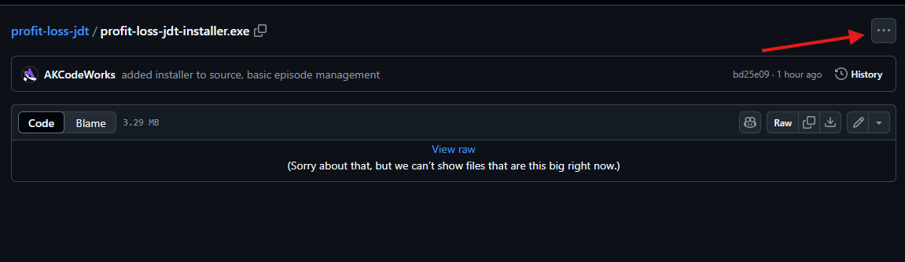

# Profit or Loss Tracker

## Made with Tauri + SvelteKit

This application has been built for Windows Machines

This is currently under development. If you choose to install this program in it's current state you will encounter bugs.

## You may download the .exe here.

### [JDTInstaller](installers)

- Click on the .exe file to go to the file.
- Click on the three dots on the right side of the screen.
  
- Click download.

## Code Sigining and Windows Installer Warnings

- When you install this app it will say that SmartScreen is protecting your computer. That is because the code is not signed.

  - Okay then just sign your code then!
    - That is a $270/year fee that I do not want to spend on such a pet project.
  - Does that mean this software is not safe?
    - No, it just means that I have not gotten the code signature.
  - What is a code signature?
    - Code signatures are what verifies a piece of software is developed by the person who is distributing it.
    - This really matters if you do not download this from the source. This GitHub repository should be the only place you ever download this application from.

- **Do not install any other copies of this application unless it is known to have been downloaded directly from this repository.**

- To continue with the installation click on the "More Info" link and proceed anyways.

## What is this for?

This is an extremely niche app for Joey of the Joey Does Tech YouTube channel. This would serve as a pseudo "asset tracker" for his popular series "Profit or Loss"

All data is saved locally and does not require an internet connection to function.

> Note: This application does utilize the Iconify and Google Fonts API. If you are not connected to the internet, the font will be set to your system font and icons will not display. The app will still function, but it just won't be as pretty.

## Support Joey Below

- [YouTube](https://www.youtube.com/c/JoeyDoesTech)
- [Twitch](https://twitch.tv/joeydoestech)
- [eBay Store](https://ebay.co.uk/str/joeydoestech)
- [Instagram](https://www.instagram.com/joeydoestech)
- [Website](https://www.joeydoestech.com)

## Support the Developer Here

